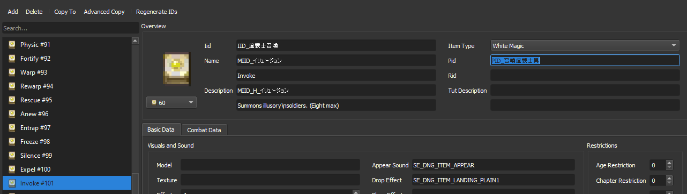
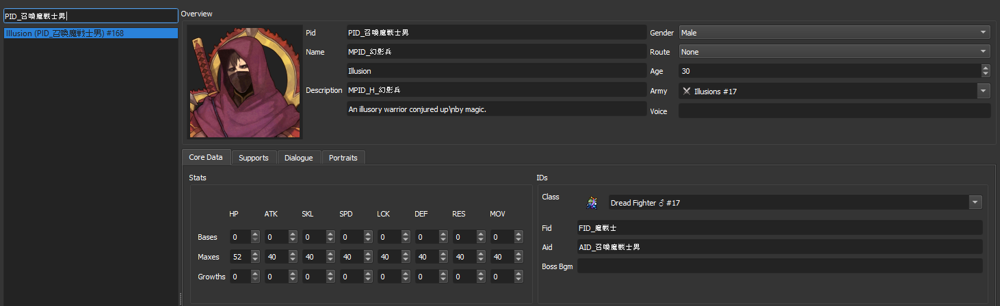

<h1 align="center"> Summoning</h1>

  
Table of Contents

  <ol>
    <li>
      <a href="#ref_01">Editing the summoned unit</a>
    </li>
    <li>
      <a href="#0">obj2</a>
      <ul>
        <li><a href="#0">obj2_1</a></li>
        <li><a href="#0">obj2_2</a></li>
      </ul>
    </li>
  </ol>

 

###### hint: [Google Translate](https://translate.google.com/) is going to be your best friend!

<h3 align="center">FAQ
</h3>
Q: Can more conjures/invokes be created? 
A: No. So far, without code.bin, no more can be created other than the ones given in the items menu.

  

### 1. Editing the summoned unit
Under the spell you are editing for, there is a field called PID.

This value dicates which character is being summoned from the spell you are editing. If you wish to edit the illusion or conjured, I recommend creating a new character and perhaps copying the character you want edited and give it a new PID and then put that PID on the spell you are editing.

To search for which character is being used by a spell, copy the PID value and paste it into the characters menu to get the character.

	
[spoiler]

	
Example with Silque's Dreadfighters summon. PID= PID_召喚魔戦士男

	

(<a href="#top">back to top</a>)

